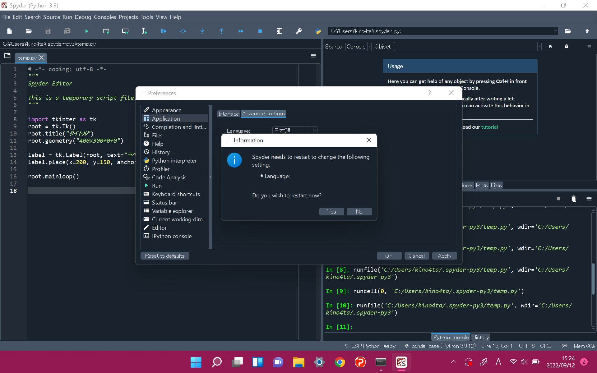

# Spyderを日本語化する方法

1. 「Tools」 → 「Preferences」をクリック。 

 

2. 「Application」 → 「Advanced settings」をクリック。 
3. 「Language」を日本語に選択。 

 

4. 「ok」ボタンを押すと、以下のようなメッセージが出るので、「Yes」を押す。 
5. 「Yes」を押すとSpyderが再起動されるので、もう一度Spyderが開かれるまで待つ。 

 

6. 画面が日本語になっていればセッティング完了。 

