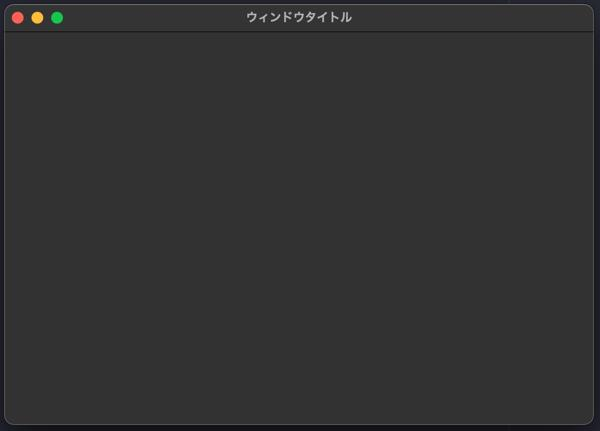
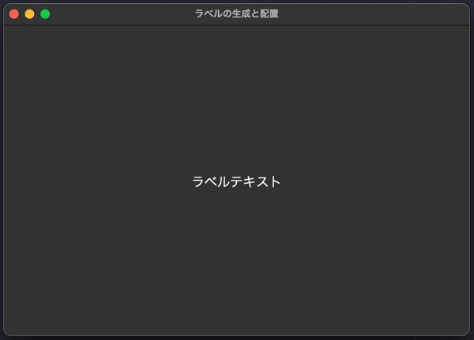
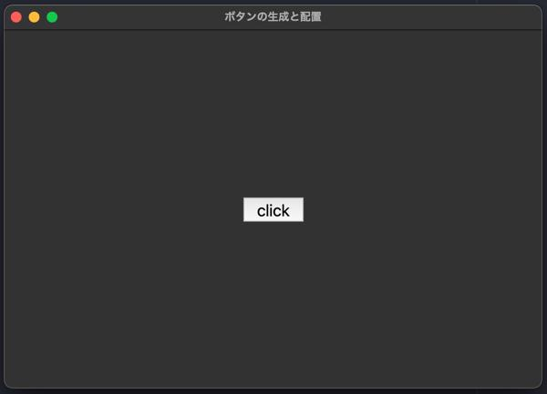
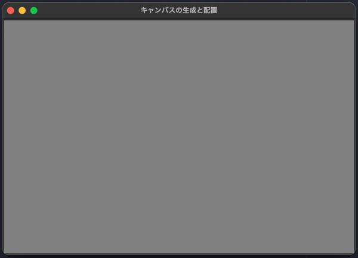
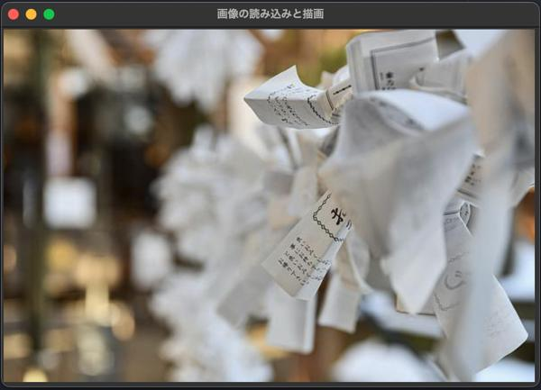

# 1. CUIについて

## CUIとは
CUI（Character User Interface）とは、文字によるコマンド入力方式のインターフェイスのこと。

<br>

## 乱数生成
Pythonではrandomモジュールを使用することによって乱数を生成することができる。

<br>

## リスト
変数を数や文字列を入れる箱とすると、リストとはその箱に番号をつけて管理するもの。<br>
リストは他の言語の配列にあたる。<br>
リストの中１つ１つを要素という。<br>
また、何番目かを管理する番号のことを添え字（インデックス）という。<br>

<br>

## おみくじアプリ(CUI)
**omikuji01.py**
``` python
# randomモジュールのインポート
import random
# リストからランダムにひとつ選び、変数に格納
result = random.choice(["大吉", "吉", "中吉", "小吉", "末吉", "凶"])
# 結果を表示
print(result)
```

---
<br>
<br>

# 2. GUIについて

## GUIとは
GUI（Graphical User Interface）とは、コンピュータの画面上に表示されるウィンドウやアイコン、ボタン、プルダウンメニューなどを使い、マウスなどのポインティングデバイスで操作できるインターフェースのこと。

<br>

## tkinterとは
tkinterとは、Pythonでグラフィック関連（表示・操作）のソフトウェアを開発するためのライブラリである。<br>
PythonでGUIを扱うためのライブラリはいくつか存在する。中でもtkinterはPythonの標準ライブラリのため、比較的導入が容易であり、デスクトップアプリケーションの開発に向いている。<br>
tkinterの他には図を描画することに特化したturtleや、ゲーム開発に特化したPygameなどがある。

<br>

# tkinterの使い方
## ＜ウィンドウ＞
**ウィンドウの表示**
``` python
# モジュールをインポート
import tkinter
# ウィンドウの部品（オブジェクト）を作成
root = tkinter.Tk()
# ウィンドウを表示するメソッド（ループ：アプリの待機とイベントの処理）
root.mainloop()
```
**ウィンドウのタイトルとサイズの指定**
``` python
# モジュールのインポート
import tkinter
# ウィンドウのオブジェクト作成
root = tkinter.Tk()
# ウィンドウタイトルを指定
root.title("ウィンドウタイトル")
# ウィンドウサイズの指定("幅x高さ")
root.geometry("600x400")
# ウィンドウを表示
root.mainloop()
```

<br>

<br>

**備考**
``` python
# ウィンドウは初期位置・最小サイズ・最大サイズ・サイズ変動不可などの指定が可能
# 初期位置の指定（"幅x高さ+横+縦"）
root.geometry("600x400+100+200")
# 最小サイズを指定
root.minsize(width=100,height=200)
# 最大サイズを指定
root.maxsize(width=800,height=400)
# サイズ変動不可
root.resizable(False, False)
```

<br>

## ＜ラベル＞
ラベルとは、文字列を表示する部品である。<br>
Label( )でラベルを作成し、place( )で配置する。<br>

<br>

**ラベルの生成と配置**
``` python
import tkinter
root = tkinter.Tk()
root.title("ラベルの生成と配置")
root.geometry("600x400")
# ラベル
label = tkinter.Label(root, text="ラベルテキスト", font=("System", 18))
label.place(x=300, y=200, anchor="c")

root.mainloop()
```
<br>
**備考**
```
ラベルの変数名 = tkinter.Label(ウィンドウオブジェクト, text="テキスト",
                            font=("フォント名", フォントサイズ))
ラベルの変数名.place(x=X座標, y=Y座標, anchor="配置場所")
```

<br>

**使えるフォントについて**<br>
tkinterで表示する文字にはフォントを指定することができるが、使用するPCによって表示できるフォントは異なる。<br>
次のコードを実行して自分のPCで使用できるフォントを調べることができる。
``` python
import tkinter
import tkinter.font
root = tkinter.Tk()
print(tkinter.font.families())
```

<br>

## ＜ボタン＞
ボタンとは、クリック判定を行い、指定した関数を実行する部品である。<br>
Button( )でボタンを作成し、place( )で配置する。<br>
commandに関数を紐づけることによって、クリックされたときに関数が呼び出される。
<br>

**ボタンの生成と配置**
``` python
import tkinter

# ボタンがクリックされたときに実行する関数
def clicked():
    btn["text"] = "clicked"

root = tkinter.Tk()
root.title("ボタンの生成と配置")
root.geometry("600x400")
# ボタン
btn = tkinter.Button(root, text="click", font=("System", 18), command=clicked)
btn.place(x=300, y=200, anchor="c")

root.mainloop()
```
<br>

<br>

**備考**
```
ボタンの変数名 = tkinter.Button(ウィンドウオブジェクト, text="テキスト",
                            font=("フォント名", フォントサイズ), command=関数)
ボタンの変数名.place(x=X座標, y=Y座標, anchor="配置場所")
```
<br>

## 関数について<br>
関数とは、コンピュータが行う処理を１つにまとめて記述したもの。<br>
Pythonの関数は「def」を用いて定義し、「関数名( ):」の記述が必要となる。
``` python
def main():
    print('おはよう')
    print('元気かい？')
    print('さようなら')

def 関数名(引数):
    処理１
    処理２
    ・・・
```

<br>

## ＜キャンバス＞
キャンバスとは、画像や図形を描くための部品である。<br>
Canvas( )でキャンバスを作成し、pack( )で配置する。<br>
**キャンバスの生成と配置**
``` python
import tkinter
root = tkinter.Tk()
root.title("キャンバスの生成と配置")
cvs = tkinter.Canvas(root, width=600, height=400, bg="grey")
cvs.pack()
root.mainloop()
```
<br>
**備考**
```
キャンバスの配置により、ウィンドウのサイズが自動で決定される。
そのため、root.geometry( )で指定していた記述を省略することができる。

変数名 = tkinter.Canvas(ウィンドウオブジェクト, width=幅, height=高さ, bg=背景色)
```

<br>

## ＜画像＞
キャンバスに画像を配置して表示する際、次の２ステップが必要となる。<br>
1. PhotoImage( )で画像ファイルを読み込む。<br>
2. create_image( )で描画する。

**画像の読み込みと描画**
``` python
import tkinter
root = tkinter.Tk()
root.title("画像の読み込みと描画")
cvs = tkinter.Canvas(root, width=600, height=400)
cvs.pack()
img = tkinter.PhotoImage(file="./sample01.png")
cvs.create_image(300, 200, anchor="c", image=img)
root.mainloop()
```
<br>
**備考**<br>
Githubの「img」ディレクトリにある[sample01.png](https://github.com/UC-k/Python_App/blob/main/img/sample01.png)をサンプル画像として使用可能。<br>
ダウンロードして実際に画像が表示されるか試してみてください。<br>
画像を読み込む際、画像のパス（file="~"）に注意。ダウンロードしてからPythonファイル
と同じディレクトリに置くと上記のコードのまま実行できる。<br>
`補足：create_image( )で指定するX座標とY座標は、anchorを指定していないと画像の中心になる。`<br>

<br>

## キャンバスで描くことができるものの例
キャンバスには色々なものを描くことができる。画像や図形、文字などがあり、それらには「tag」をつけることができる。<br><br>
「tag」をつけることによって、作成したものを管理しやすくなる。例えば、キャンバス上に作成したものを削除する場合、「cvs.delete("タグ名")」(cvs=tkinter.Canvas( ))で削除することができるが、このとき、複数のものを一度に削除したい場合、タグ名（tag）を同じにすることでそれが可能となる。<br><br>
タグに関わらず、キャンバスで生成したものを全て削除したい場合は、「delete("all")」で消すことができる。（ボタンやラベルなどの部品はキャンバス上にないから削除できない）<br>
また、図形の位置やサイズを変更したり動かしたりすることもできる。<br><br>
まずはコードをそのままコピーして動かしていただき、その後、コードを見ながら理解していただきたい。<br>
（ちなみにimport文でtkinterをインポートしているが、呼び出す際に毎回tkinterと書くのは手間なので、tkinterをtkとして省略する方法も併せて紹介する。）<br>

``` python
# import文でtkinterをtkとして扱うと宣言
import tkinter as tk
# ------------------------------------------------------------------------------
def deleteA():
    cvs.delete("A")
def deleteB():
    cvs.delete("B")
def deleteAll():
    cvs.delete("all")
def revival():
    cvs.create_text(10, 10, text="テキストテキストテキスト\n改行してテキスト", fill="blue",
                font=("System", 20), anchor="nw", tag="A")
    cvs.create_line(10, 100, 300, 150, fill="blue", width=2, tag="A")
    cvs.create_line(30, 200, 300, 250, 30, 400, 30, 200,
                fill="blue", width=5, tag="A")
    cvs.create_rectangle(500, 10, 700, 100, fill="grey",
                    outline="red", width=2, tag="B")
    cvs.create_oval(500, 200, 700, 400, fill="grey", outline="red",
                    width=4, tag="B")
# ------------------------------------------------------------------------------
root = tk.Tk()
cvs = tk.Canvas(root, width=800, height=600, bg="white")
cvs.pack()
# ------------------------------------------------------------------------------
btnA = tk.Button(root, text='「A」のみ削除', fg="blue",
                highlightbackground="white", command=deleteA)
btnB = tk.Button(root, text='「B」のみ削除', fg="red",
                highlightbackground="white", command=deleteB)
btnC = tk.Button(root, text='すべて削除',
                highlightbackground="white", command=deleteAll)
btnD = tk.Button(root, text="すべて復活",
                highlightbackground="white", command=revival)
btnA.place(x=100, y=550, anchor="c")
btnB.place(x=300, y=550, anchor="c")
btnC.place(x=500, y=550, anchor="c")
btnD.place(x=700, y=550, anchor="c")
# ------------------------------------------------------------------------------
# テキスト（x, y, text, color, font, anchor, tag）
cvs.create_text(10, 10, text="テキストテキストテキスト\n改行してテキスト", fill="blue",
                font=("System", 20), anchor="nw", tag="A")
# 線（x1, y1, x2, y2, color, 線幅, tag）
cvs.create_line(10, 100, 300, 150, fill="blue", width=2, tag="A")
# 三角形（x1, y1, x2, y2, x3, y3, x1, y1, color, 線幅, tag）
cvs.create_line(30, 200, 300, 250, 30, 400, 30, 200,
                fill="blue", width=5, tag="A")
# 矩形（x, y, x+width, y+height, 内側の色, 外線の色, 線幅, tag）
cvs.create_rectangle(500, 10, 700, 100, fill="grey",
                    outline="red", width=2, tag="B")
# 楕円（中心(x)-半径(r), 中心(y)-半径(r), x+r, y+r, 内側の色, 外側の色, 線幅, tag）
cvs.create_oval(500, 200, 700, 400, fill="grey", outline="red",
                    width=4, tag="B")
# ------------------------------------------------------------------------------
root.mainloop()
```

<br>
<br>

# おみくじアプリについて
これまでに学習した以下の内容から、おみくじアプリを作成してみましょう。
- 乱数生成
- リスト
- GUI
    - ラベル
    - ボタン

<br>

``` python
import tkinter as tk
import random
# ------------------------------------------------------------------------------
def click():
    label["text"] = random.choice(["大吉", "吉", "中吉", "小吉", "末吉", "凶"])
    label.update()
# ------------------------------------------------------------------------------
root = tk.Tk()
root.title("おみくじアプリ")
root.geometry("500x500+400+100")
root.configure(bg="#323232")
root.resizable(False, False)

label = tk.Label(root, text="おみくじ", font=("Helvetica",100),
                fg="skyblue", bg="#323232")
label.place(x=250, y=180, anchor="c")

btn = tk.Button(root, text="引く",font=("Helvetica",30),
                fg="#555555", bg="#ffffff", borderwidth=0,
                cursor="pointinghand", command=click)
btn.place(x=250, y=350, anchor="c")

root.mainloop()
```
`注意：label.update()によって画面の更新を行うことで、画面が最新の状態に切り替わる。`<br>
`キャンバス上のものを更新する場合は、「cvs.update()」。`<br>
`ウィンドウ上にあるものも、キャンバス上にあるものも、コードでは新たな情報を持ち出しているのに画面が反映されない場合は、画面の更新「update( )」がされているか確かめよう。`

<br>

# おみくじアプリに画像を入れてみる
さきほど作成したおみくじアプリでも、十分におみくじとして機能している。<br>
しかし、おみくじの雰囲気や楽しさがあまり伝わらない。<br>
そこで、さきほどのコードに少し付け足して、好きな画像を背景画像にしてみよう。<br>

``` python
import tkinter as tk
import random
# ------------------------------------------------------------------------------
def click():
    label["text"] = random.choice(["大吉", "吉", "中吉", "小吉", "末吉", "凶"])
    label.update()
# ------------------------------------------------------------------------------
root = tk.Tk()
root.title("おみくじアプリ")
root.geometry("600x400+400+100")
root.resizable(False, False)

cvs = tk.Canvas(root, width=600, height=400, bg="skyblue")
cvs.pack()

img = tk.PhotoImage(file='./sample01.png')
cvs.create_image(300, 200, image=img)

# 矩形
# cvs.create_rectangle(x, y, x+width, y+height,
#                     fill=color_in, outline=color_out, width=w, tag=tg)
cvs.create_rectangle(0, 70, 600, 220, fill="white", width=0)

label = tk.Label(root, text="おみくじ", font=("Helvetica",100),
                fg="skyblue", bg="white")
label.place(x=300, y=150, anchor="c")

btn = tk.Button(root, text="引く",font=("Helvetica",30),
                fg="#555555", bg="#ffffff", borderwidth=0,
                cursor="pointinghand", command=click)
btn.place(x=300, y=270, anchor="c")

root.mainloop()
```
`補足：背景画像を使用することによって、文字数によってラベルの背景色に偏りが出ることが目立つため、ラベルの下に矩形を用意した。`<br>

<br>

# おみくじアプリを本格的に作ってみる
ここまでで、おみくじの基本的な機能から雰囲気作りまで行い開発を進めてきました。<br>
しかし、アプリとして成立させるためにはまだ何かが足りないと感じなかったでしょうか。<br>
以下のリンクにもう少し進んで開発したおみくじアプリのGIF画像を載せたので、それを見ながらユーザにより良い体験をしてもらうにはどのような工夫をしたら良いかを考えてみてほしいです。<br>
「ここはもっとこうできないか？」「ここはこうではなくこうしよう。」などを考えながら、楽しくコードを組むことによって、みなさんのプログラミング能力も向上していきます。<br>
コードを書いて試行錯誤することが一番勉強になります。<br>
映画やアニメなどでカッコよくささっとコードを書く天才プログラマーを目にすることが多いですが、実際は「調べて試してエラーを解析して再挑戦」の繰り返しです。（デバッグも重要）<br>
根気強くループを楽しみましょう。<br>

[おみくじアプリ（応用）](https://github.com/UC-k/Python_App/blob/main/img/omikuji04.gif)

<br>

---
**おみくじアプリについては以上です。**<br>
**次回からは診断アプリの開発に着手します。**<br>