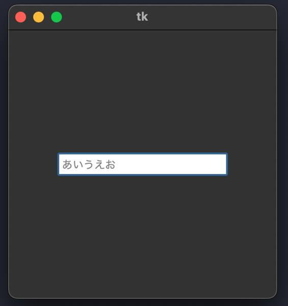
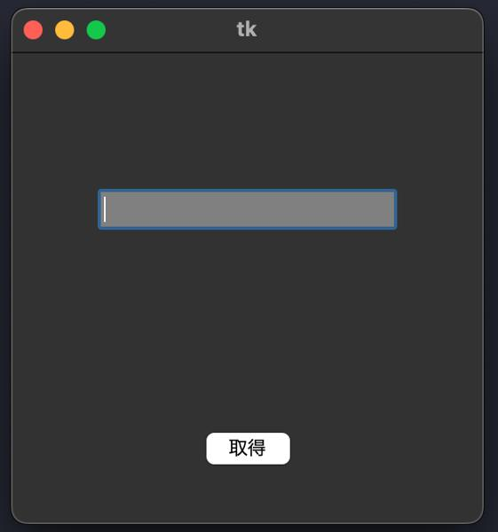
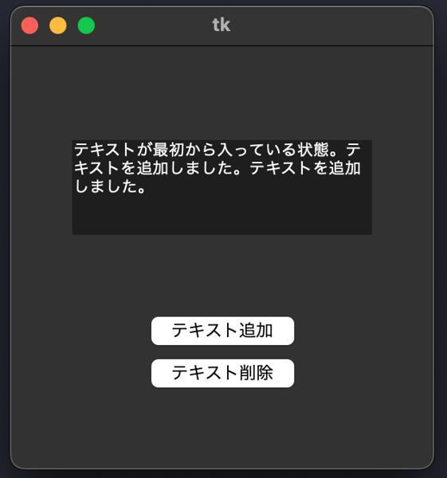
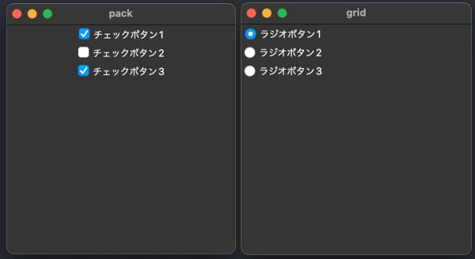
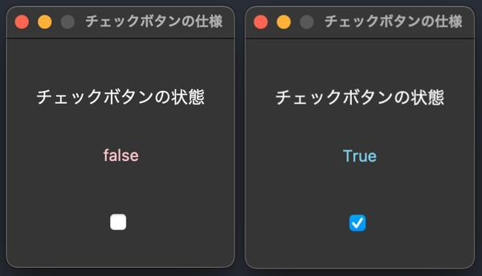
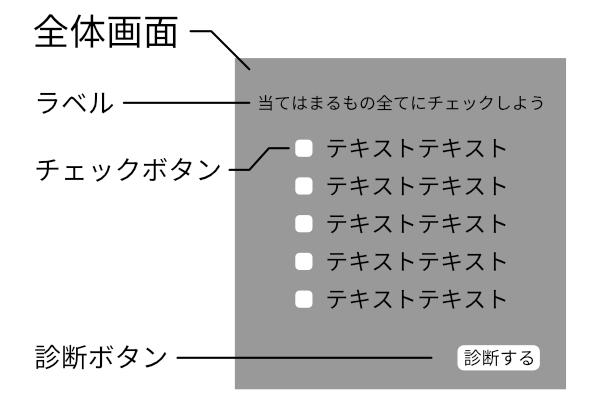
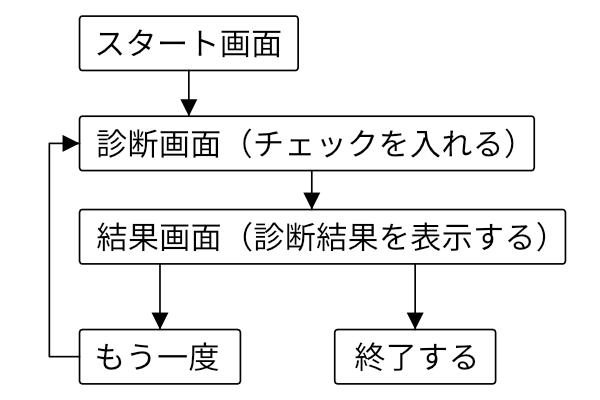

# テキストの入力
tkinterにおいて、ユーザがテキスト入力を行うことができるテキスト入力欄のオブジェクトを作成する際、
「Entry」という１行の入力欄と、「Text」という複数行の入力欄がある。<br>

<br>

## １行のテキスト入力欄について(Entry)
１行の入力欄は、「Entry( )」で作成し、「place( )」で配置する。
``` python
import tkinter as tk
root = tk.Tk()
root.geometry("300x300")
entry = tk.Entry(fg="grey", bg="white", font="System", width=20)
entry.place(x=150, y=150, anchor="c")
root.mainloop()
```
<br>

<br>

**Entryのオプションについて**
```
Entry(fg="文字色", bg="背景色", font="フォント", width=半角文字数分の横幅)
他にも(highlightbackground="囲み色"）や（justify="テキストの入力位置"）などがある。
```
`補足：これまでボタンやラベルなどを作成する際、引数に「root」を入れていたが、今回のように記載を省略することができる。これは、部品がウィンドウに自動的に配置されるためである。逆にウィンドウ以外に配置する際は記載をしなければならない。`

<br>

**Entry内のテキスト操作**<br>
Entry内のテキスト情報は「get( )」で取得することができる。<br>
例えばユーザに入力してもらったテキスト情報を取得したり、ボタン等でテキスト情報を取得して送信したりするプログラムを作成することができる。
``` python
import tkinter as tk

def info_get():
    # エントリーのテキスト情報を取得し、ボタンの文字列に代入する
    txt = entry.get()
    btn["text"] = txt

root = tk.Tk()
root.geometry("300x300")
# show=""を追加すると、入力される文字の見た目が指定したものになる
entry = tk.Entry(fg="white", bg="grey", width=20, show="*")
entry.place(x=150, y=100, anchor="c")
# エントリーにフォーカスを当てる
entry.focus_set()
btn = tk.Button(text="取得", command=info_get)
btn.place(x=150, y=250, anchor="c")
root.mainloop()
```
<br>
<br>

## 複数行のテキスト入力欄について(Text)
１行のときは「Entry( )」を用いたが、複数行を扱う際は「Text( )」を使用する。<br>
「Text( )」も「place( )」で配置する。
``` python
import tkinter as tk

def info_in():
    txt.insert(tk.END, "テキストを追加しました。")

root = tk.Tk()
root.geometry("300x300")
btn = tk.Button(text="テキスト追加", command=info_in)
btn.place(x=150, y=200, anchor="c")
# width=１行に表示する文字数　height=表示する行数
txt = tk.Text(width=30, height=5)
txt.place(x=150, y=100, anchor="c")
root.mainloop()
```
`補足：「insert( )」によって文字列を追加できる（Entryも同様）。その際、引数に追加位置と文字列を指定することができ、今回のように「END」を指定して入力欄の最後尾に文字を追加することができる。`

``` python
import tkinter as tk

def info_in():
    txt.insert(tk.END, "テキストを追加しました。")
def info_delete():
    txt.delete(1.0, tk.END)

root = tk.Tk()
root.geometry("300x300")
btn1 = tk.Button(text="テキスト追加", command=info_in)
btn1.place(x=150, y=200, anchor="c")
btn2 = tk.Button(text="テキスト削除", command=info_delete)
btn2.place(x=150, y=230, anchor="c")

txt = tk.Text(width=30, height=5)
txt.place(x=150, y=100, anchor="c")
txt.insert(tk.END, "テキストが最初から入っている状態。")
root.mainloop()
```
<br>
`補足：「delete(開始位置, 終了位置)」で、EntryやTextの文字列を削除することができる。（開始位置の「1.0」は１行目の０文字目という意味））`

<br>
<br>

# チェックボタン
チェックボタンは、項目の選択を行う際に用いる四角い枠のことである。<br>
クリックすることによってチェックマークをつけたり外したりすることができる。<br>
類似部品として、ラジオボタンがある。<br>
ラジオボタンは「●」がつくのに対し、チェックボタンは「レ」がつく。<br>
ラジオボタンは複数の選択肢から１つ選ぶのに対し、チェックボタンは複数選択できる。<br>
「Checkbutton( )」で作成し、「place( )」等で配置する。
``` python
import tkinter as tk
root = tk.Tk()
root.geometry("300x300")
cbtn = tk.Checkbutton(text="チェックボタン")
cbtn.pack()
root.mainloop()
```
`補足：「place( )」で座標指定して配置する他に、「grid( )」、「pack( )」で配置する方法がある。`

<br>

``` python
import tkinter as tk

# メインウィンドウ
root = tk.Tk()
root.title("pack")
root.geometry("300x300")

# サブウィンドウ（ウィンドウを複数作成できる）
sub_root = tk.Toplevel()
sub_root.title("grid")
sub_root.geometry("300x300")

# チェックボタンとpack()
cbtn1, cbtn2, cbtn3 = tk.Checkbutton(root, text="チェックボタン1"),\
                        tk.Checkbutton(root, text="チェックボタン2"),\
                        tk.Checkbutton(root, text="チェックボタン3")
cbtn = [cbtn1, cbtn2, cbtn3]
[cbtn[i].pack() for i in range(0,3,1)]

# ラジオボタンとgrid()
var = tk.IntVar()
var.set(0) # 最初に0のときチェックを入れておく
rbtn1, rbtn2, rbtn3 = tk.Radiobutton(sub_root,value=0,variable=var,text="ラジオボタン1"),\
                        tk.Radiobutton(sub_root,value=1,variable=var,text="ラジオボタン2"),\
                        tk.Radiobutton(sub_root,value=2,variable=var,text="ラジオボタン3")
rbtn = [rbtn1, rbtn2, rbtn3]
[rbtn[s].grid() for s in range(0,3,1)]

root.mainloop()
```
<br>
- `補足１：メインウィンドウとは別に、サブウィンドウを「Toplabel( )」で作成できる。`<br>
- `補足２：１行のコードが長くなった際、「\」で改行して続けて書くことができる。`<br>
- `補足３：ラジオボタンのチェック判定において、「var=tk.IntVar( )」の他に「StringVar()」や「BooleanVar()」を用いることができる。`
- `補足４：「[中身 for i in 繰り返す回数]」のように、リスト内包表記を用いて新しいリストを生成するだけでなく、繰り返し文を１文で書くことができる。(詳しくは以下を参照)`<br>

<br>

## リスト内包表記について
``` python
# for文による繰り返し文
numList = []
for i in range(5):
    numList.append(i)
print(numList)
# 出力（↓）
# [0, 1, 2, 3, 4]

# リスト内包表記
numList = [i for i in range(5)]
print(numList)
# 出力（↓）
# [0, 1, 2, 3, 4]
```
リスト内包表記を用いることにより、より簡潔にコードを書くことができる。<br>
`注意：リスト内包表記ではif文をつけたりもできるが、最初は無理をしないで、コードを書くことに慣れたらリスト内包表記を使ってみよう！`<br><br>

リスト内包表記でチェックボタンやラジオボタンを配置する例を示した。<br>
チェックボタンやラジオボタンは単体で使うことは少なく、複数を生成する必要があることが多い。<br>
しかし実は、上記の方法以外でリストを使用して生成と配置をfor文でまとめて行うことができる。<br>
その方法は診断アプリを作成する際に示すが、どのようにしたらできるか少し考えてみよう。<br>
`以下ヒント`<br>
``` python
bool_var = [None]*チェックボタンの数
check_btn = [None]*チェックボタンの数
text = ["チェックボタンの１つ目のテキスト",
        "チェックボタンの２つ目のテキスト",
        "チェックボタンの３つ目のテキスト",
        ・・・]
for i in range(チェックボタンの数):
    bool_var = tk.BooleanVar()
    bool_var[i].set(False)
    check_btn[i] = tk.Checkbutton(text=" "+ITEM[i], variable=bool_var[i])
    check_btn[i].place(x=...+x1*i, y=...+y1*i)
```

<br>

## チェックボタンの仕様について
ラジオボタンにおいて、チェック判定をする際に「var=tk.IntVar( )」等を用いた。<br>
チェックボタンは「BooleanVar( )」を用いてTrueかFalseの判定を行う。<br>
`チェックボタンにチェックがついていないときは「False」、ついているときは「True」を返す。`
``` python
import tkinter as tk
# ------------------------------------------------------------------------------
# チェックボタンがTrueかFalseか判定する関数
def check():
    if vbar.get() == True:
        # Trueなら画面上に「True」を表示
        label2.config(text="True", fg="skyblue")
    else:
        # Falseなら画面上に「False」を表示
        label2.config(text="false", fg="pink")
    root.after(100, check)
# ------------------------------------------------------------------------------
root = tk.Tk()
root.title("チェックボタンの仕様")
root.geometry("200x200+300+100")
root.resizable(False, False)
# ------------------------------------------------------------------------------
# ラベルの配置
label1 = tk.Label(text="チェックボタンの状態", bg="#323232", font=("System", 16))
label1.place(x=100, y=50, anchor="c")
label2 = tk.Label(text="", bg="#323232", font=("System", 14))
label2.place(x=100, y=100, anchor="c")
# ------------------------------------------------------------------------------
# チェックボタンの準備と配置
# チェックのTrueかFalseを格納する変数を宣言
vbar = tk.BooleanVar()
vbar.set(False)
# variableにvbarを設定することで、vbarの変動と連動する
cbtn = tk.Checkbutton(variable=vbar)
cbtn.place(x=100, y=160, anchor="c")
# ------------------------------------------------------------------------------
check()
root.mainloop()
```

<br>
### `発展`<br>
チェックボタンを判定する関数において、「after( )」処理をおこなっている。<br>
「after(時間, 処理)」により、**時間**ごとに**処理**を行う命令を下しているため、0.1秒ごとに関数「check」を行っていることになる。これによりリアルタイム処理が可能となる。<br>
今回、after処理によって、『チェックボタンの判定を行い、Trueならラベルのテキストを「True」にして色をskyblueに、Falseならラベルのテキストを「False」にして色をpinkにする処理』を0.1秒ごとに実行していることになる。<br>
（1000 -> 1秒、　100 -> 0.1秒、　10 -> 0.01秒）<br>
afterメソッドはtkinterで定期的に処理を行う際に用いる機能である。しかし、処理をしっかり管理しないと、期待していないところで永遠に処理をしていることがあるので注意が必要。
<br><br>
リアルタイム処理について、after処理の他に、tkinterなら「bind」を使う手法もある。<br>
「bind」を使用すれば、例えばクリックされたとき、例えばあるウィジェット内にマウスが入ったときなど、ある一定の条件を満たすと、指定した処理をさせることができる。<br>
GUIアプリを開発する中でとても便利な機能なので、「bind」については診断アプリの応用で実際に使用して解説する。

<br>

# 診断アプリ
テキスト入力とチェックボタンについて学びました。<br>
これらを用いて診断アプリを作成します。<br>
実際にみなさんにも独自のアプリを開発してもらいます。<br>
まずは例をみながら診断アプリを作成し、今まで学んだことを活かし、ここで作成する診断アプリをベースに独創性溢れるアプリを開発してください。<br><br>

コードを組む前に、どのようなアプリを開発するのか、流れを確認します。<br>
画面構成を考えるために、簡単なレイアウトスケッチを作成してみましょう。<br>

### **画面構成**<br>
<br>

### **流れ**<br>
<br>

<br>

1. スタート画面を描画します。
2. 「スタート画面のボタン」を押すと、スタート画面に設置してあったウィジェットで必要のないものを削除し、診断画面に移行します。
3. 診断画面で、ユーザにチェックボタンにチェックを入れてもらうフェーズを設けます。チェックボタン、テキスト、次に進むためのボタンを設置します。
4. 「次に進む」ボタンを押すと、チェックボタンなどの必要ないウィジェットを削除し、結果画面へ移行します。
5. ユーザがチェックした数と連動して、結果を表示します。
6. 「もう一度」と「終了する」のボタンを結果画面に設置し、「もう一度」を押すと診断画面へ移動し、「終了する」を押すとウィンドウが閉じます。

<br>

はじめにスタート画面を作成しましょう。
``` python
import tkinter as tk
# ------------------------------------------------------------------------------
root = tk.Tk()
root.title("診断アプリ")
root.geometry("600x600+300+100")
root.resizable(False, False)
# ------------------------------------------------------------------------------
cvs = tk.Canvas(root, width=600, height=600, bg="#323232")
cvs.pack()
# ------------------------------------------------------------------------------
root.mainloop()
```
<br>
次に、必要なウィジェットを用意します。<br>
今回は必要なのは、<br>

- スタート画面での「次に進むボタン」、「スタート画面の背景画像」
- 診断画面での「次に進むボタン」、「チェックボタン」、「説明ラベル」
- 結果画面での「結果テキスト」、「もう一度ボタン」、「終了するボタン」

以上になります。<br>
また、チェックボタンと連動する質問テキスト、チェックボタンのTrueの数によって変動する結果テキストも一緒に用意しておきましょう。今回はチェックボタンを12個用意しました。<br>
少しコードが長くなりますが、診断アプリの核となる部分なので、しっかりおさえましょう。<br>
[使用する画像](https://github.com/UC-k/Python_App/blob/main/img/start.png)はGitHubにアップしてあるので、必要に応じてダウンロードしてください。

``` python
import tkinter as tk
# ------------------------------------------------------------------------------
# 変数宣言
bool_var = [None]*12
check_btn = [None]*12
ITEM = [
    "チェックボタンの質問1",
    "チェックボタンの質問2",
    "チェックボタンの質問3",
    "チェックボタンの質問4",
    "チェックボタンの質問5",
    "チェックボタンの質問6",
    "チェックボタンの質問7",
    "チェックボタンの質問8",
    "チェックボタンの質問9",
    "チェックボタンの質問10",
    "チェックボタンの質問11",
    "チェックボタンの質問12"
]
# チェックボタンの数＋１用意する
RESULT = [
    "チェックが0つのときに結果に表示するテキスト",
    "チェックが1つのときに結果に表示するテキスト",
    "チェックが2つのときに結果に表示するテキスト",
    "チェックが3つのときに結果に表示するテキスト",
    "チェックが4つのときに結果に表示するテキスト",
    "チェックが5つのときに結果に表示するテキスト",
    "チェックが6つのときに結果に表示するテキスト",
    "チェックが7つのときに結果に表示するテキスト",
    "チェックが8つのときに結果に表示するテキスト",
    "チェックが9つのときに結果に表示するテキスト",
    "チェックが10つのときに結果に表示するテキスト",
    "チェックが11つのときに結果に表示するテキスト",
    "チェックが12つのときに結果に表示するテキスト"
]
# ------------------------------------------------------------------------------
root = tk.Tk()
root.title("診断アプリ")
root.geometry("600x600+300+100")
root.resizable(False, False)
# ------------------------------------------------------------------------------
cvs = tk.Canvas(root, width=600, height=600, bg="#323232")
cvs.pack()
# ------------------------------------------------------------------------------
# ウィジェットの準備
# 画像
start_img = tk.PhotoImage(file="./shindan/start.png")
# ボタン
start_btn = tk.Button(text="START", font=("Futura", 30), cursor="pointinghand",
                    fg="#3271A1", bg="#FFFFFF", command=None)

main_btn = tk.Button(text="診断する", font=("System", 20), cursor="pointinghand",
                    fg="grey", bg="white", command=None)

again_btn = tk.Button(text="もう一度", font=("System", 10), cursor="pointinghand",
                        fg="#323232", bg="#FFFFFF", command=None)
end_btn = tk.Button(text="終了する", font=("System", 10), cursor="pointinghand",
                    fg="#323232", bg="#FFFFFF", command=None)
# チェックボタン
for i in range(12):
    bool_var[i] = tk.BooleanVar()
    bool_var[i].set(False)
    check_btn[i] = tk.Checkbutton(text=" "+ITEM[i], font=("System", 16),
                                fg="white", bg="#323232", variable=bool_var[i])
# テキスト
how_txt = tk.Label(text="当てはまるもの全てにチェックを入れよう", font=("System", 22),
                    fg="skyblue", bg="#323232")
result_txt = tk.Text(width=30, height=7, font=("System", 24))
# ------------------------------------------------------------------------------
root.mainloop()
```

<br>
これでウィジェットの準備はできました。<br>
それでは次に画面と流れを作るために関数を作成しましょう。<br>
流れは、<br>

- start（スタート画面）
- main（診断画面）
- result（結果画面）
- again or end（結果画面を見た後の行動）

となります。今まで学習したことが総攻撃してくるような関数ですので、気を引き締めましょう。


``` python
# start
def start():
    global flg
    cvs.create_image(300, 300, image=start_img, tag="start")
    start_btn.place(x=300, y=530, anchor="c")
# main
def main():
    # 画面整理
    cvs.delete("start")
    start_btn.place_forget()
    # チェックボタン等の配置
    for i in range(12):
        check_btn[i].place(x=130, y=60+40*i, anchor="nw")
    main_btn.place(x=500, y=550, anchor="c")
    how_txt.place(x=300, y=30, anchor="c")
# result
def check():
    # 画面整理
    for i in range(12):
        check_btn[i].place_forget()
    main_btn.place_forget()
    how_txt.place_forget()
    # 診断
    cnt = 0
    for i in range(12):
        if bool_var[i].get():
            cnt += 1
    per = int(cnt/12 * 100)
    # 結果表示
    result_txt.insert("1.0", "あなたのPython習熟度は"+str(per)+"%です。\n\n"
                    +RESULT[cnt])
    result_txt.place(x=300, y=200, anchor="c")
    # もう一度やるかやめるか
    again_btn.place(x=420, y=550, anchor="c")
    end_btn.place(x=520, y=550, anchor="c")
# again or end
def again():
    # 画面整理
    result_txt.delete("1.0", tk.END)
    result_txt.place_forget()
    again_btn.place_forget()
    end_btn.place_forget()
    for i in range(12):
        bool_var[i].set(False)
    # 診断画面に戻る
    main()
def end():
    root.destroy()
```

<br>

ここまでできたらほぼ完成です。以上のコードを組み合わせて完成です。<br>
[完成したコードはこちら](https://github.com/UC-k/Python_App/blob/main/shindan01.py)

<br>
<br>

# 診断アプリ（応用）
さらにアプリらしさを追及するため、以下の機能を追加しました。<br>

- ボタンの上にマウスが重なった時、離れた時の処理
- 診断結果を表示するまでのロード描写

これまでに応用としてさらっと紹介してきましたが、以上の機能を実装するために<br>

- bind
- after

を主として使用します。逆にこの２つの処理をうまく使いこなすことができれば、より素晴らしいアプリに近づくことができます。<br>

**具体的な使用箇所**<br>
「bind」はスタート画面から診断画面、診断画面から診断画面に移るためのボタンで使用し、ボタンの上にマウスが重なるとボタンの文字色が変化するようにし、ボタンとしてのインターフェイスを高める。「after」は診断結果を表示するまでのロード画面を作成し、リアルタイムで診断結果を処理している描写を行い、ユーザの期待を高める。<br>

### **bind**
``` python
import tkinter as tk
# ------------------------------------------------------------------------------
# bind (bind時、関数には引数が必要)
def btn_in(self):
    btn.config(fg="#FF5FF7")
def btn_out(self):
    btn.config(fg="#3271A1")
# ------------------------------------------------------------------------------
root = tk.Tk()
root.title("Python習熟度診断アプリ")
root.geometry("600x600+300+100")
root.resizable(False, False)
# ------------------------------------------------------------------------------
cvs = tk.Canvas(root, width=600, height=600, bg="#323232")
cvs.pack()
# ------------------------------------------------------------------------------
# ボタン
btn = tk.Button(text="ボタン", font=("Futura", 30), cursor="pointinghand",
                fg="#3271A1", bg="#FFFFFF", command=None)
btn.bind("<Enter>", btn_in)
btn.bind("<Leave>", btn_out)
btn.place(x=300, y=300, anchor="c")
# ------------------------------------------------------------------------------
root.mainloop()
```
`「対象.bind("<イベント>", 処理)」で、対象にイベントが生じたとき、処理をするように指示できる。`
<br>

この場合、btn（ボタン）に"マウスが重なるとき（"< Enter >"）、btn_inの処理が実行され、btn（ボタン）から"マウスが離れたとき（"< Leave >"）、btn_outの処理が実行される。
<br>

### **after**
``` python
import tkinter as tk
import math
# ------------------------------------------------------------------------------
bar1 = 0
bar2 = 0
load = 0
# ------------------------------------------------------------------------------
def start():
    global bar1, bar2, load
    # ロード中のサークル描画
    cvs.create_arc(100, 100, 500, 500, width=8, style=tk.ARC, outline="#01FACA",
            start=90, extent=bar1, tag="load")
    cvs.create_arc(100, 100, 500, 500, width=8, style=tk.ARC, outline="#01FACA",
            start=270, extent=bar2, tag="load")
    cvs.update()
    # 中心にパーセントを表示
    if load < 100:
        load += 1.38
    elif load > 100:
        load = 100
    load_txt.config(text=str(math.floor(load))+"%")
    # 円を徐々に描写
    if bar2 >= -180:
        if bar1 >= -180:
            bar1 -= 5
        elif bar1 < -180:
            bar2 -= 5
        root.after(1, start)
# ------------------------------------------------------------------------------
root = tk.Tk()
root.title("Python習熟度診断アプリ")
root.geometry("600x600+300+100")
root.resizable(False, False)
# ------------------------------------------------------------------------------
cvs = tk.Canvas(root, width=600, height=600, bg="#323232")
cvs.pack()
# ------------------------------------------------------------------------------
load_txt = tk.Label(text="0%", font=("DSEG7 Classic", 30),
                    fg="#01FACA", bg="#323232")
load_txt.place(x=300, y=300, anchor="c")

start()
root.mainloop()
```
`.after(秒数, 処理)で、秒数ごとに処理を実行するように指示できる。`<br>
この場合、円を0度から360度まで徐々に描いていくように見せる処理をしている。<br>
ただ、tk.ARCスタイルの円描画処理（.create_arc）では、360度までは実際に描くことができず、きれいな閉じた円を描くことはできないので、２つ用意してそれぞれ180度ずつ描くようにしている。